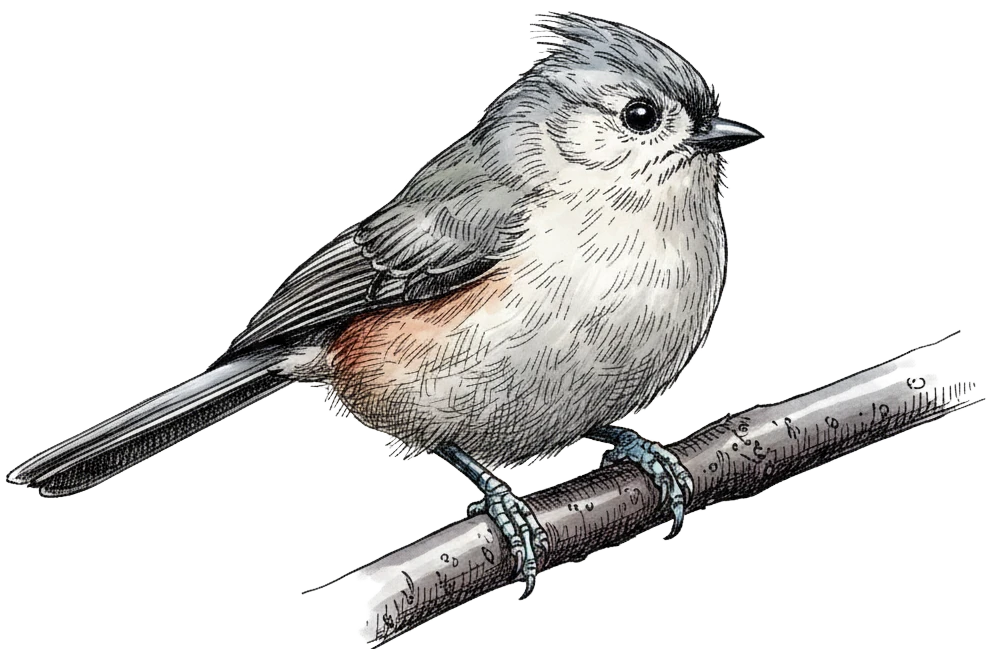

# The Tufted Titmouse

The Tufted Titmouse (*Baeolophus bicolor*) is a small songbird native to the deciduous forests of eastern North America. It is easy to recognize thanks to its soft grey crest, large dark eyes, and rust-colored flanks. In winter it often joins mixed feeding flocks with chickadees and nuthatches.

We can model their population dynamics with the logistic growth equation:

$$
\frac{dP}{dt} = rP \left(1 - \frac{P}{K}\right)
$$

where $P$ is population size, $r$ is intrinsic growth rate, and $K$ is the carrying capacity of the habitat.
